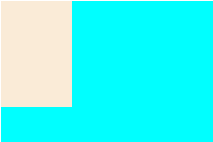
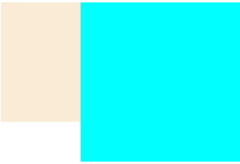
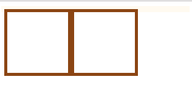
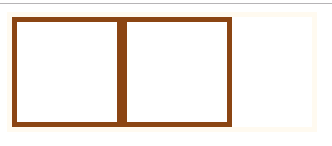
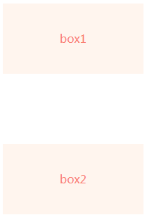
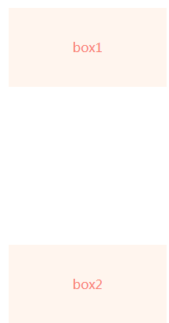

## 什么是 BFC

BFC（Block formatting context）译为“块级格式化上下文”。只有块级元素参与，它规定了内部的块级盒子如何布局，并且与这个区域外部毫不相干。

## 布局规则

1. 内部的块级元素会在垂直方向，一个个接着放置。
2. 块级元素垂直方向的距离由 margin 决定，在同一个 BFC 内的两个相邻的块级元素的 margin 会发生重叠。
3. 每个元素的 margin box 的左边，与包含块 border box 的左边相接触(对于从左往右的格式化，否则相反)。即使存在浮动也是如此。
4. 计算 BFC 的高度时，浮动元素也参与计算。（可用于解决浮动造成的高度塌陷问题）
5. BFC 的区域不会与 float box 重叠(解决浮动元素文字环绕问题)。

## 如何生存 BFC

1. 根元素，即 HTML 元素
2. position: fixed/absolute
3. float 不为 none
4. overflow 不为 visible
5. display 的值为 inline-block、table-cell、table-caption、flex

## BFC 的应用场景

- 自适应两栏布局：

```html
<style>
  body {
    width: 300px;
    position: relative;
  }
  .aside {
    width: 100px;
    height: 150px;
    float: left;
    background-color: antiquewhite;
  }
  .main {
    height: 200px;
    background-color: aqua;
  }
</style>
<body>
  <div class="aside"></div>
  <div class="main"></div>
</body>
```



根据 BFC 布局规则第三条：每个元素的 margin box 的左边，会包含块 border box 的左边相接触（对于从左往右的格式化，否则相反），即使存在浮动也是如此，同时再根据 BFC 布局规则第四条：BFC 的区域不会与 float box 重叠。那我们就可以通过触发 main 生成 BFC，从而实现自适应两栏布局

```html
<style>
  .main{
  　　height: 200px;
  　　background-color: aqua;
      overflow：hidden；
  }
</style>
```



- 清除内部浮动

```html
<style>
  .content {
    border: 5px solid floralwhite;
    width: 300px;
  }
  .child {
    border: 5px solid saddlebrown;
    width: 100px;
    height: 100px;
    float: left;
  }
</style>
<body>
  <div class="content">
    <div class="child"></div>
    <div class="child"></div>
  </div>
</body>
```



根据 BFC 布局规则第六条：计算 BFC 的高度时，浮动元素也参与计算。此时为了达到清除内部浮动，我们可以触发 content 触发生成 BFC，那么 content 在计算高度时，content 内部的浮动元素 child 也会参与计算

```html
<style>
  .content {
    border: 5px solid floralwhite;
    width: 300px;
    overflow: hidden;
  }
</style>
```



- 防止垂直 margin 重叠

```html
<style>
  p {
    color: salmon;
    background-color: seashell;
    width: 200px;
    line-height: 100px;
    text-align: center;
    margin: 100px;
  }
</style>
<body>
  <p>box1</p>
  <p>box2</p>
</body>
```



上面两个模块之间发生了margin重叠，而根据BFC布局规则第二条：Box垂直方向的距离有margin决定。属于同一个BFC的两个相邻Box的margin会发生重叠。这样的话我们可以在p 元素外面包裹一层容器，并触发该容器生成一个BFC。那么两个p元素不属于同一个BFC，就不会发生margin重叠了。

```html
<style>
  .wrap {
    overflow: hidden;
  }
  p {
    color: salmon;
    background-color: seashell;
    width: 200px;
    line-height: 100px;
    text-align: center;
    margin: 100px;
  }
</style>
<body>
  <p>box1</p>
  <div class="wrap">
    <p>box2</p>
  </div>
</body>
```



## 外边距折叠规则

- 两个相邻的外边距都是正数时，折叠结果是它们两者之间较大的值。
- 两个相邻的外边距都是负数时，折叠结果是两者绝对值的较大值。
- 两个外边距一正一负时，折叠结果是两者的相加的和。

## 参考

[*BFC原理和作用* --Kbin24](https://www.cnblogs.com/kbinblog/p/10919693.html "BFC原理和作用")
