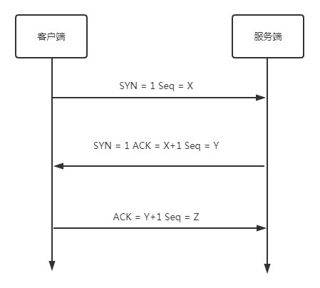

## 前言

前端主要和网页打交道，但是都知道从我们打开浏览器到页面呈现都发生了什么吗？先让大家看看基本的流程步骤：

客户端获取 URL - > DNS 解析 - > TCP 连接 - >发送 HTTP 请求 - >服务器处理请求 - >返回报文 - >浏览器解析渲染页面 - > TCP 断开连接

其实这流程中主要了解知识点：

- 什么是 DNS 解析
- TCP 的三次握手和四次挥手
- 浏览器如何渲染页面

接下来就让我们一一学习其中的原理

## 什么是 URL

我们要先了解什么是`URL`，它的作用是什么

`URL` 统一资源定位符，用于定位互联网上资源，俗称网址。  
基本遵守以下语法规则： `scheme://host.domain:port/path/filename`

- scheme - 定义因特网服务的类型。常见的协议有 http、https、ftp、file，其中最常见的类型是 http，而 https 则是进行加密的网络传输。
- host - 定义域主机（http 的默认主机是 www）
- domain - 定义因特网域名，比如 w3school.com.cn
- port - 定义主机上的端口号（http 的默认端口号是 80）
- path - 定义服务器上的路径（如果省略，则文档必须位于网站的根目录中。
- filename - 定义文档/资源的名称

## 域名解析(DNS)

人们在访问网站或者其他主机时，通常是需要通过 IP 地址定位到服务器的。但是长串的数字只是适合计算机去处理，而不方便人们去记忆，所以人们通常通过域名去访问其他主机。而机器却不认得这个域名，所以就有了域名解析

### 1、什么是域名解析

DNS 是一个网络服务器，我们的域名解析简单来说就是在 DNS 上记录一条信息记录。  
例如：baidu.com 220.114.23.56（服务器外网 IP 地址）80（服务器端口号）

### 2、浏览器是如何通过域名查找 URL 的 IP

- 浏览器缓存：浏览器会按照一定的频率缓存 DNS 记录。
- 操作系统缓存：如果浏览器缓存中找不到需要的 DNS 记录，那就去操作系统中找。
- 路由缓存：路由器也有 DNS 缓存。
- ISP 的 DNS 服务器：ISP 是互联网服务提供商(Internet Service Provider)的简称，ISP 有专门的 DNS 服务器应对 DNS 查询请求。
- 根服务器：ISP 的 DNS 服务器还找不到的话，它就会向根服务器发出请求，进行递归查询（DNS 服务器先问根域名服务器.com 域名服务器的 IP 地址，然后再问.baidu 域名服务器，依次类推）

## TCP 的三次握手和四次挥手

当用户能成功找到服务器之后，就要开始建立连接来传输数据，这里用的就是 TCP 连接。

### 三次握手

- 客户端发送一个带 SYN=1，Seq=X 的数据包到服务器端口（第一次握手，由浏览器发起，告诉服务器我要发送请求了）

- 服务器发回一个带 SYN=1， ACK=X+1， Seq=Y 的响应包以示传达确认信息（第二次握手，由服务器发起，告诉浏览器我准备接受了，你赶紧发送吧）

- 客户端再回传一个带 ACK=Y+1， Seq=Z 的数据包，代表“握手结束”（第三次握手，由浏览器发送，告诉服务器，我马上就发了，准备接受吧）

为什么要三次握手？为了防止已失效的连接请求报文段突然又传送到了服务端，因而产生错误

### 四次挥手

主动方发送没有数据的信号，被动方发送确认信号，被动方发送没有数据发送信号，主动方发送确认信号

- 发起方向被动方发送报文，Fin、Ack、Seq，表示已经没有数据传输了。并进入 FIN_WAIT_1 状态。(第一次挥手：由浏览器发起的，发送给服务器，我请求报文发送完了，你准备关闭吧)

- 被动方发送报文，Ack、Seq，表示同意关闭请求。此时主机发起方进入 FIN_WAIT_2 状态。(第二次挥手：由服务器发起的，告诉浏览器，我请求报文接受完了，我准备关闭了，你也准备吧)

- 被动方向发起方发送报文段，Fin、Ack、Seq，请求关闭连接。并进入 LAST_ACK 状态。(第三次挥手：由服务器发起，告诉浏览器，我响应报文发送完了，你准备关闭吧)

- 发起方向被动方发送报文段，Ack、Seq。然后进入等待 TIME_WAIT 状态。被动方收到发起方的报文段以后关闭连接。发起方等待一定时间未收到回复，则正常关闭。(第四次挥手：由浏览器发起，告诉服务器，我响应报文接受完了，我准备关闭了，你也准备吧)

四次挥手是防止被动方未传输完数据，主动方就断开连接

## 浏览器渲染页面

具体流程如图

- 根据HTML生成DOM树，根据css生成CSSOM树
- 结合DOM树和CSSOM树生成渲染（Render）树
- 根据渲染树计算每一个节点的信息
- 绘制页面（重绘是改变这一步）

## 参考

- [_从 URL 输入到页面展现到底发生什么？_ --浪里行舟](https://juejin.im/post/5bf3ad55f265da61682afc9b)
